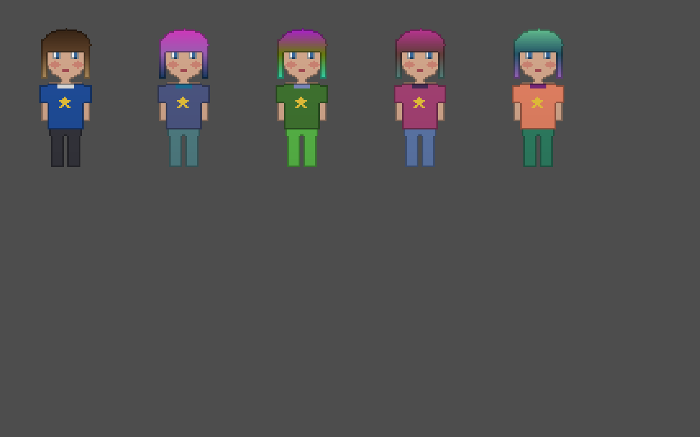

# Paper Doll

Criador de personagens 2D em camadas, com recolorização por máscara no estilo *Create a Style* do The Sims 3.



**Princípio:** o artista entrega **luz e regiões, nunca cor**. A cor é um parâmetro escolhido no jogo (pelo jogador, por um preset ou pelo gerador de NPCs). Assim, o número de assets cresce de forma aditiva, e as combinações possíveis continuam crescendo de forma multiplicativa.

```
CharacterDescriptor ─▶ Resolver ─▶ BakePlan ─▶ DecalRasterizer ─▶ BakeCompositor ─▶ Texture2D
     (JSON)           (C# puro)    (dados)       (CPU, Image)       (GPU, SubViewport)   (sprite sheet)
```

- **Pipeline de arte** (este README): como as peças são pintadas, exportadas e validadas.
- **Compositor de bake** ([docs/compositor-de-bake.md](docs/compositor-de-bake.md)): como a receita do personagem vira uma textura.
- **Editor do jogador** ([docs/editor-do-jogador.md](docs/editor-do-jogador.md)): a interface que monta a receita.

## Estrutura

```
paperdoll/
├── requirements.txt
├── tools/
│   ├── export_aseprite.py        .aseprite → shade.png / mask.png / line.png + meta.json
│   ├── validate_assets.py        valida as peças exportadas contra o contrato (fail-fast, serve de CI)
│   └── make_sample_assets.py     gera peças de exemplo (formas simples) para testar sem arte real
├── docs/
│   └── compositor-de-bake.md
└── godot/                        projeto Godot 4.7 (.NET)
    ├── data/contract.json        o contrato: fonte única de verdade (Python e C# leem o mesmo arquivo)
    ├── assets/<slot>/<peça>/     peças exportadas
    ├── decals/<nome>.png         decalques (estampas, tatuagens)
    ├── shaders/paperdoll_piece.gdshader
    ├── src/                      compositor de bake (C#)
    ├── editor/                   editor do jogador (cena principal)
    ├── demo/                     cena demo + personagem de exemplo
    └── test/                     teste de fumaça do compositor e do editor
```

## Início rápido

1. Abra `godot/` no Godot 4.7 .NET e rode o projeto (F5). Isso abre o **editor do jogador**: troque peças, pinte regiões, coloque decalques, salve e carregue personagens.
2. A cena `demo/demo.tscn` (F6) assa o personagem de exemplo e 4 variações de cor. **Espaço** ou **Enter** gera novas variações.
3. Para rodar o teste de fumaça, abra `test/smoke_test.tscn` e rode a cena (F6). O resultado sai no console, e as imagens vão para `user://smoke_test/`.

Para regenerar as peças de exemplo e validar:

```bash
pip install -r requirements.txt
python tools/make_sample_assets.py --contract godot/data/contract.json --godot godot
python tools/validate_assets.py   --contract godot/data/contract.json --assets godot/assets
```

---

## 1. Anatomia de uma peça

Cada peça é uma pasta com até quatro arquivos, **todos com o mesmo tamanho e o mesmo layout de frames**:

| Arquivo | Conteúdo | Obrigatório |
|---|---|---|
| `shade.png` | Volume e sombreamento em **tons de cinza**. A silhueta vem do alpha. | sim |
| `mask.png` | Regiões pintáveis nos canais R, G e B. | sim |
| `line.png` | Contorno com cor fixa, que não recebe tinta. | não |
| `meta.json` | Regiões usadas, cores padrão, zonas de decalque, tags. | sim |

`piece_id` usa só `[a-z0-9_]` e é igual ao nome do arquivo-fonte.

## 2. O contrato (`godot/data/contract.json`)

É a fonte única de verdade. O validador Python e o compositor C# leem o mesmo arquivo.

### Canvas

**Todas as peças usam o canvas do personagem inteiro**: mesma largura e altura de frame e mesmo número de frames para todos os slots. Isso elimina pivots e âncoras: uma peça está no lugar certo porque foi desenhada sobre o manequim, no mesmo canvas. O espaço transparente sobrando não custa nada em runtime, porque o bake achata tudo numa textura só.

Os frames ficam lado a lado na horizontal: `largura do PNG = frame_width × frames`.

### Categorias e regiões

A categoria define o **significado** de cada canal. Esse significado não muda de peça para peça:

| Categoria | base (sem máscara) | R | G | B | Gradientes na máscara |
|---|---|---|---|---|---|
| `skin` | Tom de pele | Rubor | Lábios | Maquiagem | sim |
| `hair` | Cor base | Raiz | Mechas | Pontas | sim |
| `clothing` | Primária | Secundária | Detalhe | Estampa | não (bordas duras) |
| `eyes` | Esclera | Íris | — | — | não |

Os nomes das regiões vêm do contrato e aparecem na UI do editor. A peça só declara **quais** canais usa.

### Slots e tags

Cada slot tem uma categoria e um `z_order` único (ordem de desenho, do fundo para a frente). O z-order é do slot, não da peça. O cabelo é dividido em `hair_back` (atrás do corpo) e `hair_front`.

As tags formam uma lista fechada. Uma peça só pode usar tags desta lista, o que pega erros de digitação.

## 3. Regras do `shade.png`

- **Só tons de cinza.** A saturação por pixel (`max(R,G,B) − min(R,G,B)`) não pode passar de `shade.max_saturation`.
- **Puxado para o claro.** A cor final é `shade × cor`, e multiplicação só escurece. O valor médio dos pixels visíveis precisa ser `≥ shade.min_mean_value`. Um shade escuro nunca vai gerar loiro platinado.
- **Silhueta no alpha.** Fundo transparente. Um shade sem transparência é rejeitado.
- **Contorno:** fica no shade (valores escuros, herda a tinta e vira um tom escuro da cor escolhida) ou vai para `line.png` (cor fixa). Escolha **um** dos dois para o jogo inteiro.

## 4. Regras do `mask.png`

**Peso de uma região = valor do canal × alpha da máscara.** Pixel transparente é "sem região". Por isso o artista pinta a máscara numa camada comum, com fundo transparente.

- **A região base recebe o que sobra:** `base = 1 − (R + G + B)`. As regiões formam uma partição, e o resultado não depende de ordem de aplicação.
- **R + G + B ≤ 255** em cada pixel (com folga de `mask.sum_tolerance` para arredondamento). Uma transição entre duas regiões é um gradiente de uma cor pura para a outra. Por exemplo, na raiz→pontas do cabelo, de `(255,0,0)` a `(0,0,255)`: a soma fica sempre em 255.
- **Nada fora da silhueta:** nenhum pixel pintado na máscara onde o shade é transparente.
- **Canais declarados = canais pintados.** Um canal pintado sem declaração em `meta.regions` é erro. Um canal declarado sem pintura também (a UI mostraria uma região morta).
- **Categorias sem gradiente** (`mask_gradients: false`) exigem valores 0 ou 255. Anti-aliasing na máscara de uma roupa em pixel art mistura regiões e gera franjas coloridas.

## 5. `meta.json`

```json
{
  "id": "shirt_02",
  "regions": {
    "base": { "default": "#2255aa" },
    "r":    { "default": "#f2f2f2" }
  },
  "decal_zones": [
    { "name": "peito", "rect": [26, 50, 12, 10],
      "frame_offsets": [[0,0], [0,1], [0,1], [0,0], [0,0], [0,1], [0,1], [0,0]] }
  ],
  "tags": [],
  "hides_slots": [],
  "requires_tags": ["body_humanoid"]
}
```

| Campo | Significado |
|---|---|
| `id` | Igual ao nome da pasta. |
| `regions` | `base` é obrigatória. Os outros são canais da categoria que esta peça usa, cada um com a cor padrão `#RRGGBB`. A cor padrão só é usada quando o editor equipa a peça, nunca no bake. |
| `decal_zones` | Áreas onde estampas e tatuagens são permitidas. `rect` = `[x, y, largura, altura]` no frame 0. `frame_offsets` tem uma entrada por frame: `[dx, dy]` para acompanhar a animação, ou `null` quando a zona não aparece naquele frame (ex.: personagem de costas). |
| `tags` | Tags que esta peça fornece. |
| `hides_slots` | Slots escondidos quando esta peça está equipada (ex.: um chapéu fechado esconde `hair_front`). |
| `requires_tags` | Tags que alguma peça equipada precisa fornecer. |

Nenhum campo é opcional, e campos desconhecidos são erro. Listas vazias são válidas.

## 6. Template no Aseprite

Um arquivo-template por slot, que o artista duplica para cada peça nova:

- Canvas `frame_width × frame_height`, com os `frames` e as tags de animação do corpo base já criados.
- Camadas de topo (fora de grupos): `shade`, `mask` e, se o projeto usar, `line`. Mantenha-as visíveis.
- Camadas-guia com nome começando em `_` (ex.: `_manequim`, `_referencia`). O exportador pede cada camada pelo nome, então as guias nunca saem no export.
- Ao lado do `.aseprite`, crie o `<piece_id>.meta.json`.

```
art/src/<slot>/<piece_id>.aseprite
art/src/<slot>/<piece_id>.meta.json
```

## 7. Fluxo

```
pintar (Aseprite) → exportar → validar → importar no Godot → conferir no jogo
```

```bash
# Exporta todas as peças (ASEPRITE aponta para o executável)
ASEPRITE="/caminho/para/aseprite" python tools/export_aseprite.py --src art/src --out godot/assets

# Valida tudo. Sai com código 1 se houver qualquer problema, e serve como passo de CI.
python tools/validate_assets.py --contract godot/data/contract.json --assets godot/assets
```

> O exportador segue a documentação da linha de comando do Aseprite, mas ainda não foi rodado contra um Aseprite real. Teste com uma peça antes de confiar.

## 8. Importação no Godot 4

Os valores padrão de importação de textura 2D já servem, e os `.import` das peças estão versionados:

- **Compress → Mode: Lossless.** Compressão com perda (VRAM, Lossy) mistura canais em blocos e destrói a máscara. O `DecalRasterizer` recusa decalques comprimidos.
- **Mipmaps → Generate: desligado.**

Em builds exportados, inclua `*.json` no filtro de arquivos não-recurso do preset de exportação, para que `meta.json`, o contrato e os descriptors entrem no pacote.

## 9. Checklist do artista

- [ ] Duplicou o template do slot certo (canvas e frames já corretos)
- [ ] `shade` sem nenhuma cor, puxado para o claro
- [ ] `mask` só dentro da silhueta, uma cor pura por região, transições como gradiente entre cores puras
- [ ] Roupas e olhos: máscara sem anti-aliasing
- [ ] `meta.json` com os canais realmente pintados, cores padrão e `frame_offsets` das zonas de decalque
- [ ] Exportou e o validador passou
- [ ] Conferiu a peça no jogo com cores extremas (branco, preto, saturado, pele muito clara e muito escura)
