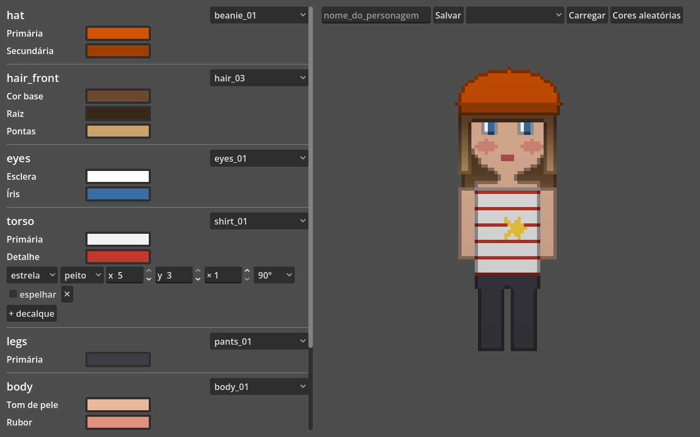

# Editor do jogador



Cena principal do projeto (`editor/character_editor.tscn`, F5). É a interface em que o jogador monta o personagem. Toda interação altera só o `CharacterDescriptor`, e o preview é sempre a textura assada pelo `BakeCompositor`, exatamente como ela aparece no jogo.

```
UI (CharacterEditor) ──▶ DescriptorEdits ──▶ CharacterDescriptor ──▶ Resolver ──▶ BakeCompositor ──▶ preview
```

## O que dá para fazer

- **Trocar ou remover a peça** de cada slot. A lista vem das pastas em `res://assets/<slot>/`, então uma peça nova aparece sem mexer em código.
- **Pintar cada região** da peça com uma roda de cor. Os rótulos ("Raiz", "Gola", "Tom de pele") vêm do contrato.
- **Decalques** nas peças que têm zonas: imagem, zona, posição, escala inteira, rotação em 90° e espelhamento. A posição máxima é recalculada a partir do tamanho da zona e do decalque já rotacionado e escalado, então não dá para arrastar para fora.
- **Salvar e carregar** em `user://characters/<nome>.json`. O arquivo é o próprio descriptor.
- **Cores aleatórias** em todas as regiões, para testar combinações extremas.

## Regras

- **Equipar uma peça usa as cores padrão do meta e começa sem decalques** (`DescriptorEdits.Equip`). É o único lugar em que as cores padrão são lidas.
- **Descriptors são imutáveis:** cada edição devolve um descriptor novo. Isso deixa `DescriptorEdits` testável sem UI e é a base para desfazer/refazer no futuro.
- **O último estado vence:** o editor não enfileira um bake por mudança. Ele marca o descriptor como "sujo" e, quando o bake anterior termina, assa só o estado mais recente. Arrastar a roda de cor não acumula bakes atrasados.
- **Erro não apaga o preview:** se o descriptor ficar inválido (ex.: remover o corpo, que as outras peças exigem pela tag `body_humanoid`), a lista de erros aparece em vermelho embaixo do preview, e o preview continua mostrando o último estado válido.
- **Abrir um descriptor valida antes** (`CharacterEditor.Open`): um arquivo inválido é recusado com a lista de erros, e o editor não muda.

## Arquivos

| Arquivo | Responsabilidade |
|---|---|
| `editor/CharacterEditor.cs` | Interface montada em código: seções por slot, barra de ferramentas, preview, status. |
| `src/DescriptorEdits.cs` | Edições puras do descriptor: equipar, remover, pintar, decalques. |
| `src/DecalLibrary.cs` | Lista os decalques de `res://decals/`, carrega a imagem e calcula o tamanho transformado (usado pelo editor e pelo `DecalRasterizer`). |
| `src/PieceCatalog.cs` | `Pieces(slot)` lista as peças disponíveis em cada slot. |

## Teste

O teste de fumaça (`test/smoke_test.tscn`) abre o editor e o opera pela própria UI:

- abre com preview e sem erro;
- recusa um descriptor inválido sem mudar de estado;
- muda uma cor pela roda de cor;
- empurra a posição do decalque para além da zona e confere o limite;
- troca uma peça e remove outra pelo seletor;
- salva, abre outro personagem, carrega de volta e confere que o descriptor voltou idêntico.

O print acima foi gerado por esse teste.

## Próximos passos

- Desfazer/refazer (pilha de descriptors).
- Nomes de exibição para slots e peças no contrato e no meta (hoje a UI mostra os ids).
- Paletas curadas por região (tons de pele, cores naturais de cabelo) ao lado da roda livre.
- Gerador de NPCs: peça aleatória por slot + cores sorteadas das paletas curadas, respeitando `requires_tags`.
